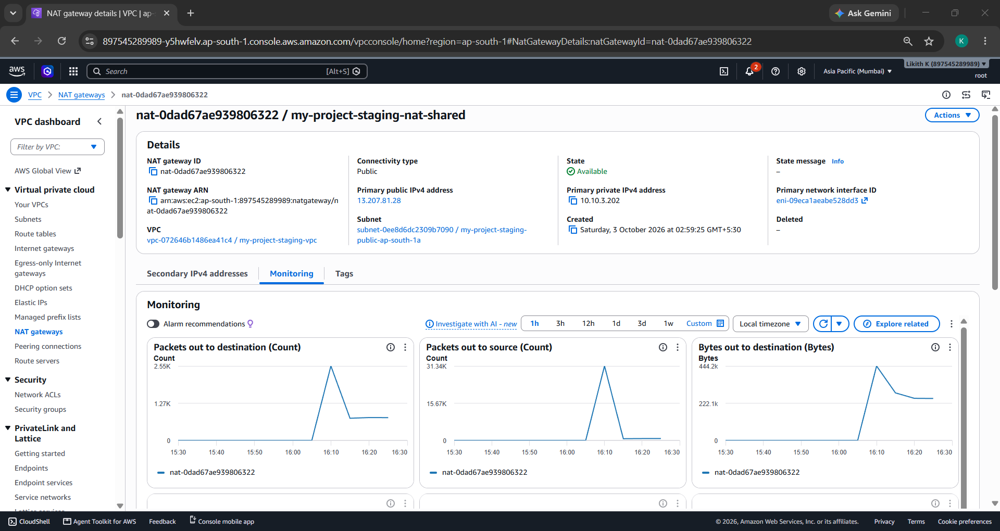
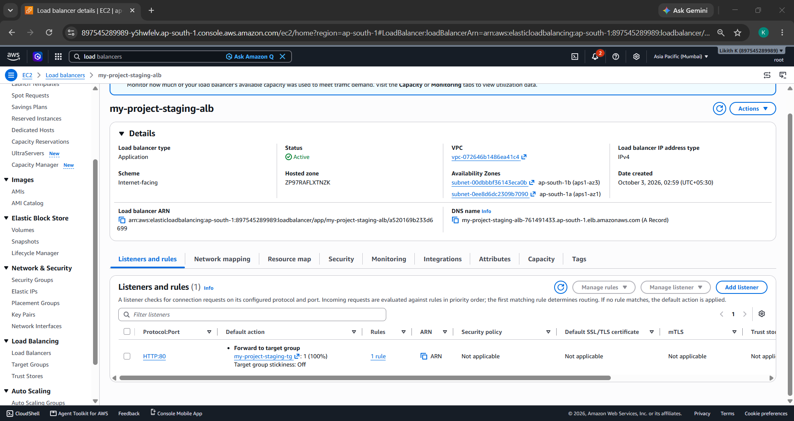
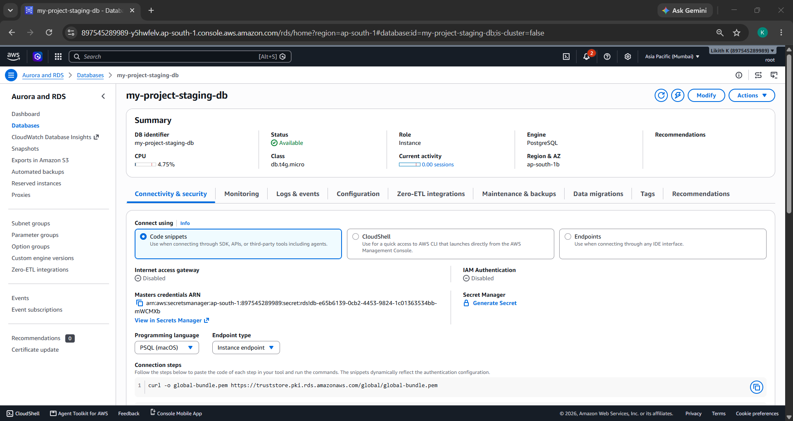
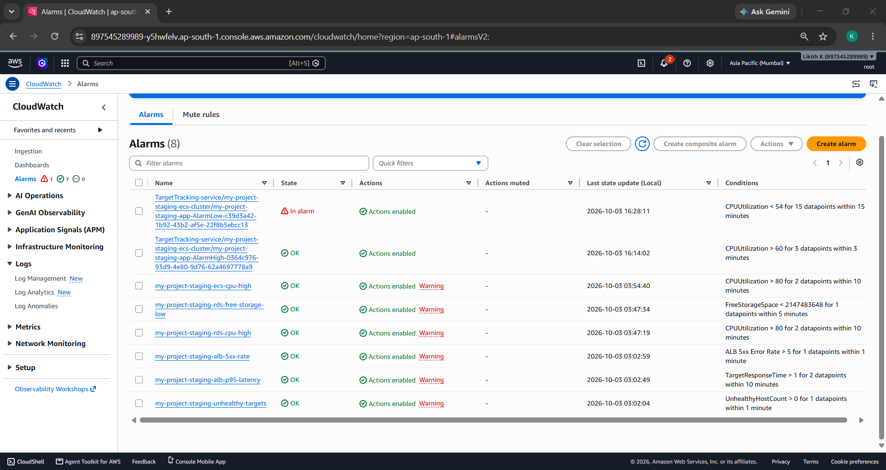
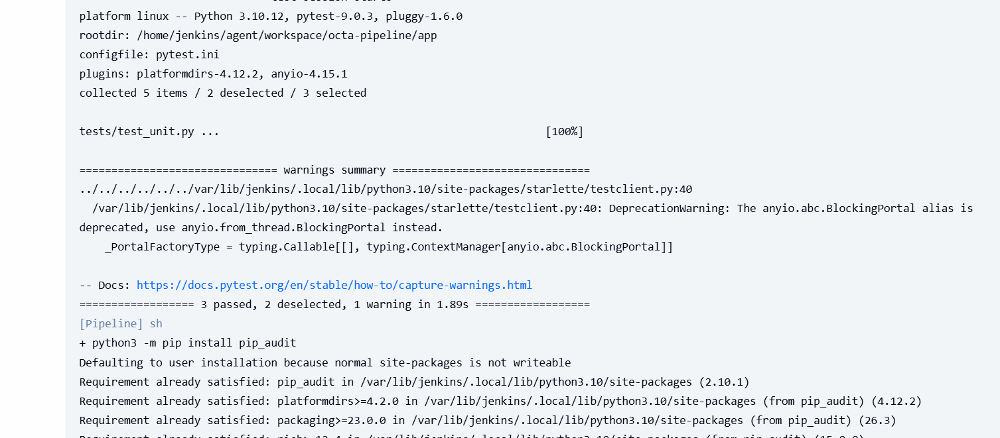

# 8byte DevOps Assignment

A small FastAPI + PostgreSQL app, provisioned on AWS with Terraform, deployed through a Jenkins CI/CD pipeline with a manual production-approval gate, and observed with CloudWatch dashboards, alarms, and centralized logging.

Application logic is intentionally trivial (an items list backed by Postgres) — the point of this assignment is the infrastructure, the pipeline, the observability, and the operational judgment behind each choice, not the app itself.

## Architecture

```
                         Internet
                            │
                     ┌──────▼──────┐
                     │     ALB     │  public subnets (2 AZs)   ──► access logs → S3
                     └──────┬──────┘
                            │  SG: only ALB → app port
              ┌─────────────▼─────────────┐
              │  ECS Service (Fargate)    │  private-app subnets (2 AZs)
              │  2 tasks, autoscaling     │  ──► stdout JSON logs → CloudWatch Logs
              └─────────────┬─────────────┘
                            │  SG: only App → 5432
                     ┌──────▼──────┐
                     │ RDS Postgres│  private-db subnets (2 AZs) — no internet route at all
                     └─────────────┘  ──► postgres logs → CloudWatch Logs

  Outbound from private subnets → NAT Gateway (public subnet) → Internet (ECR, Secrets Manager)

  Supporting: ECR (images) · Secrets Manager (DB credentials) · S3 (TF state + ALB logs)
              CloudWatch (metrics, alarms, dashboards) · SNS (alerts) · Jenkins (CI/CD)
```

Region: **`ap-south-1`** (Mumbai) — lowest latency for an India-based team and customers.

## Repository structure

```
app/                       FastAPI + psycopg app, unit + integration tests, Dockerfile
Terraform/
  modules/
    network/                VPC, 3-tier subnets, NAT, route tables, VPC flow logs
    security/                alb-sg -> app-sg -> db-sg chain
    alb/                     ALB, target group, listener, access-log bucket
    rds/                     PostgreSQL instance, Secrets Manager password, backups
    ecs/                     cluster, task def, service, autoscaling, IAM roles
    monitoring/              SNS, alarms, 2 dashboards, saved Logs Insights queries
  envs/
    shared/                  ECR repo + Jenkins deploy IAM user
    staging/                 calls every module with staging-sized values
    production/              same modules, production-safe values (Multi-AZ, deletion protection, ...)
scripts/deploy.sh          registers a new ECS task definition revision with the new image, updates the service
Jenkinsfile                tests -> scan -> build -> push -> deploy staging -> manual approval -> deploy production
docker-compose.yml         local dev: app + Postgres
CHALLENGES.md              real issues hit while building this and how they were resolved
```

## Architecture decisions

| Decision | Alternatives considered | Why |
|---|---|---|
| **ECS on Fargate** | EC2 + ASG, EKS | No nodes to manage, native ALB/IAM/Secrets/CloudWatch integration, smallest Terraform surface for a single stateless service. EKS is the natural next step if the number of services grows. |
| **Separate Terraform roots per environment**, not `terraform workspace` | Workspaces with one root | Explicit per-env config (prod has Multi-AZ, deletion protection, longer backups), smaller blast radius, no risk of accidentally applying to the wrong environment. |
| **S3 backend with native locking** (`use_lockfile = true`) | DynamoDB lock table | Terraform ≥ 1.10 supports S3-native locking; one less resource to manage. State bucket created manually (versioning + encryption + public-access-block enabled) rather than via Terraform, to avoid the chicken-and-egg problem of state storing its own state. |
| **RDS-managed master password** (`manage_master_user_password = true`) | Manually generated password in a `.tfvars`/Secrets Manager resource | The password is never written to Terraform code, state diffs, or the repo. RDS generates, stores, and rotates it automatically — this is the project's secret-management deliverable. |
| **A dedicated IAM user scoped to deploy-only permissions** for Jenkins | A broad admin user, long-lived root keys | The `shared` Terraform root creates one IAM user whose policy only allows ECR push/pull and the specific ECS actions needed to deploy. Jenkins never holds anything more powerful than that. |
| **Security groups reference security groups, not CIDRs** | CIDR-based rules | `alb-sg → app-sg → db-sg` stays correct as tasks scale/IPs change; nothing can reach the DB except the app, nothing can reach the app except the ALB. |
| **`lifecycle.ignore_changes` on the ECS task definition/desired_count** | Let Terraform always own the running image | The CD pipeline owns which image is live; autoscaling owns task count. Without this, every `terraform apply` would roll the service back to whichever image Terraform last knew about. |
| **Pipeline fetches the task definition from AWS rather than keeping a JSON copy in git** | Store/version a task-def JSON file in the repo | Terraform owns the task definition's *shape* (roles, env vars, secrets); the pipeline only swaps the image. One source of truth instead of two that can drift. |
| **Build once, promote the same image** (same SHA-tagged image goes to staging then production) | Rebuild for each environment | Guarantees what was tested in staging is byte-for-byte what reaches production. |
| **CloudWatch over self-hosted ELK/Prometheus** | ELK, Loki, Grafana Cloud | Zero infrastructure to run and pay for at this scale; native integration with every AWS service used here. |

## Prerequisites

| Tool | Notes |
|---|---|
| Terraform ≥ 1.10 | needed for S3 native state locking |
| AWS CLI v2 | configured with a named profile that has admin access |
| Docker (with buildx + Compose v2) | to build/run the app locally and in CI |
| Python 3.12 | to run the app and its tests locally |
| Jenkins | Pipeline, Git, AWS Credentials plugins; `jq` and `trivy` installed on the build agent |
| An AWS account | with MFA on root; billing alert set up before creating anything |
| A Slack workspace | with an Incoming Webhook for pipeline notifications |

## Setup and run

### 1. Run the app locally (no AWS needed)

```bash
docker compose up --build
# app:    http://localhost:8000
# health: http://localhost:8000/health
```

### 2. Create the Terraform state bucket (manual, one-time)

Create an S3 bucket by hand in the AWS Console: unique name, region `ap-south-1`, **versioning enabled**, default encryption on, public access blocked. Put that bucket name into the `bucket = "..."` line in every `backend.tf` under `Terraform/envs/*`.

### 3. Provision AWS infrastructure, in order

```bash
cd Terraform/envs/shared && terraform init && terraform apply
# build and push one image manually so the ECS service has something to pull on its first deploy:
aws ecr get-login-password --region ap-south-1 | docker login --username AWS --password-stdin <ECR_REPO_URL>
docker build -t app ./app
docker tag app:latest <ECR_REPO_URL>:bootstrap
docker push <ECR_REPO_URL>:bootstrap
# put that image URI into envs/staging/terraform.tfvars and envs/production/terraform.tfvars as app_image

cd ../staging && terraform init && terraform apply
cd ../production && terraform init && terraform apply
```

### 4. Configure Jenkins

- Install plugins: Pipeline, Git, AWS Credentials.
- Credential `aws-creds` — type **Username with password** (username = AWS Access Key ID, password = Secret Access Key) for the IAM user created by `envs/shared`.
- Credential `slack-webhook-url` — type **Secret text**, your Slack Incoming Webhook URL.
- Point the job at this repository and run it.

### 5. Trigger the pipeline

Push to `main` → Jenkins runs unit tests, a dependency scan, integration tests, builds the image, scans it with Trivy, pushes to ECR, deploys to staging, smoke-tests it, then **pauses** on the `Approve Production` stage until someone clicks **Deploy** in the Jenkins UI. Once approved, the exact same image is promoted to production.

## CI/CD pipeline

| Stage | What it does |
|---|---|
| `unittest` | installs deps, runs `pytest -m unit`, runs `pip-audit` (dependency vulnerability scan) |
| `Integration Test` | spins up a throwaway Postgres via `docker compose`, initializes the schema, runs `pytest -m integration`, tears the DB down |
| `Build and scan docker image` | `docker build`, then Trivy scans the image for CRITICAL/HIGH CVEs |
| `Push docker image to ECR` | tags the image with the short git SHA, pushes to ECR |
| `deploy to staging` | registers a new ECS task definition revision with the new image, updates the service, waits for it to stabilize |
| `Approve Production` | **pauses the pipeline** until a human clicks Deploy — the manual-approval requirement |
| `deploy to production` | promotes the *exact same* image that was just verified in staging |

A Slack message posts to `#jenkins` on every build success/failure via an Incoming Webhook.

## Monitoring and logging

**Dashboards** (`Terraform/modules/monitoring`, defined as Terraform code):
- **Application dashboard** — ALB request rate, 4xx/5xx error counts, p50/p95/p99 latency.
- **Infrastructure dashboard** — ECS CPU/memory, RDS CPU/connections/free storage/latency.

**Alarms → SNS → email**: ALB 5xx error rate, p95 latency, unhealthy target count, ECS CPU, RDS CPU, RDS free storage.

**Centralized logging**:
| Category | Source | Destination |
|---|---|---|
| Application logs | JSON stdout from the container | CloudWatch Logs `/ecs/<prefix>-app` |
| Access logs | every HTTP request at the edge | ALB access logs in S3 |
| System logs | network flows, DB engine logs | VPC Flow Logs + RDS log exports, both in CloudWatch Logs |

## Security considerations

- **Network isolation**: 3-tier subnets; the database tier has no route to the internet at all. Security groups are chained (`alb-sg → app-sg → db-sg`), referencing group IDs rather than CIDRs.
- **Encryption**: RDS storage encrypted at rest; `rds.force_ssl` enabled for encryption in transit.
- **IAM least privilege**: the ECS *execution* role (pulls images, writes logs, reads the one DB secret ARN it needs) is kept separate from the *task* role (used by application code — empty here, since the app calls no AWS APIs).
- **Scoped CI/CD credentials**: Jenkins authenticates with a dedicated IAM user whose policy only grants ECR push/pull and the specific ECS deploy actions — never broad/admin access.
- **Secrets**: DB credentials are generated and rotated by RDS into Secrets Manager; never in code, state, tfvars, or the repo. The Slack webhook URL and AWS credentials are Jenkins credentials, not repo secrets.
- **Image hygiene**: `IMMUTABLE` ECR tags (a tag can never be overwritten, so a deployed image is always traceable back to one commit), scan-on-push, and a Trivy CRITICAL/HIGH gate at build time.
- **Known gaps / next steps**: no HTTPS listener (no domain available for this demo), no WAF, no customer-managed KMS keys.

## Cost optimization

- `db.t4g.micro` (Graviton) with `gp3` storage; RDS storage autoscaling avoids a disk-full outage without over-provisioning up front.
- Staging uses a single shared NAT gateway; production uses one per AZ for resilience — a single boolean controls this per environment.
- CloudWatch Logs retention is finite everywhere instead of the default infinite retention.
- ECR lifecycle policy expires untagged images and keeps only the last N tagged ones.
- Every resource is tagged (`Project`, `Environment`, `ManagedBy`) via provider `default_tags` for cost allocation.
- Non-production environments can be destroyed when idle since state lives safely in S3.

## Secret management and backup strategy

**Secret management**: RDS generates and stores the master password in Secrets Manager; it's injected into the running container only at task start via the ECS `secrets` block, and the execution role can read only that one secret ARN. Nobody — not Terraform, not a human — ever needs to type or see the password.

**Backup strategy**: RDS automated backups with point-in-time recovery. *Known limitation*: this AWS account is on the credit-based Free Tier, which caps paid backup storage — `db_backup_retention_days` is currently set to `0` for that reason (documented further in `CHALLENGES.md`). On a standard account this would be 3-14 days as originally designed; the Terraform already supports a non-zero value, it's purely an account-tier constraint, not an architecture choice.

## Screenshots

### Application

| | |
|---|---|
| App reachable via its ALB URL |  |
| `/health` and `/api/items` responding |  |

### Networking

| | |
|---|---|
| VPC and subnets across AZs |  |
| Public route table → Internet Gateway |  |
| Private route table → NAT Gateway |  |
| NAT Gateway |  |

### Security groups

| | |
|---|---|
| All three security groups |  |
| Inbound rule referencing another SG (not a CIDR) |  |

### Load balancer and compute

| | |
|---|---|
| Application Load Balancer |  |
| Target group health |  |
| ECS cluster/service |  |
| ECS tasks running |  |
| ECS task definition revision |  |

### Database and secrets

| | |
|---|---|
| RDS instance |  |
| RDS backup/maintenance configuration |  |
| Secrets Manager entry for the DB credential |  |

### Images

| | |
|---|---|
| ECR repository with immutable, SHA-tagged images |  |

### Monitoring and logs

| | |
|---|---|
| Application dashboard |  |
| Infrastructure dashboard |  |
| CloudWatch alarms |  |
| ECS application logs |  |

### State management

| | |
|---|---|
| Terraform state bucket (versioning enabled) |  |

### Terraform apply

| | |
|---|---|
| Production environment applying cleanly |  |

### CI/CD pipeline

| | |
|---|---|
| Full pipeline — every stage green |  |
| Unit + integration tests passing |  |
| Dependency vulnerability scan (`pip-audit`) |  |
| Container vulnerability scan (Trivy) |  |
| Image pushed to ECR |  |
| **Manual approval gate — pipeline paused, waiting for a human to click Deploy** |  |
| Slack notification on build completion |  |

## Known challenges

See `CHALLENGES.md` for the full list of real issues hit while building this (AWS Free Tier backup-retention caps, invalid RDS engine versions, reserved master usernames, Jenkins agent missing `jq`/plugins, line-ending corruption in shell scripts, a branch-condition bug, a stale Docker volume masking the wrong database credentials, and more) along with how each was diagnosed and resolved.

## Teardown

```bash
cd Terraform/envs/production && terraform destroy   # disable deletion_protection first
cd Terraform/envs/staging    && terraform destroy
cd Terraform/envs/shared     && terraform destroy
```
Then empty and delete the manually-created state bucket from the S3 console if you're fully done.

## What I'd add with more time

- HTTPS via ACM + a WAF web ACL on the ALB.
- Multibranch Pipeline / webhook-triggered builds instead of manual/poll-based triggering.
- Scheduled drift detection (`terraform plan` on a cron, alert on diff).
- Separate AWS accounts for staging/production under AWS Organizations.
- Proper DB schema migrations (Alembic) instead of create-on-startup.
- Bump `fastapi`/`starlette` to versions without the known CVEs currently left as advisory-only in the dependency scan.

